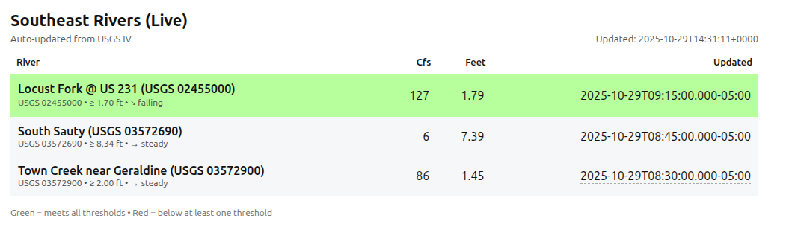

# USGS River Monitoring System

A containerized river gauge monitoring system that tracks USGS water levels, sends email alerts, and displays live data on a web dashboard.

## Features

- 📊 Real-time monitoring of multiple USGS river gauges
- 📧 Email alerts for threshold crossings (IN/OUT)
- 📈 Percentage change alerts (20%+ changes)
- 🌐 Live web dashboard with trend indicators
- ⏳ Stale data warnings for gauges not updating
- 🗄️ SQLite state persistence with alert cooldowns
- 🌧️ NWS Quantitative Precipitation Forecast (QPF) integration
- 📱 Mobile-responsive dashboard with 7-day historical charts
- 🎨 **Multi-level color coding for river conditions**
- 🌡️ **Temperature alerts** (< 55°F highlighted in light blue)
- 💨 **Wind alerts** (> 10 mph highlighted in yellow)
- 📈 **Color-coded trend indicators** (rising = green, falling = light red)
- 🧪 **Comprehensive test suite** for visual indicator verification

---

## Table of Contents

- [Visual Indicators & Color Coding](#visual-indicators--color-coding)
- [Testing Visual Indicators](#-testing-visual-indicators)
- [Quick Start](#quick-start)
  - [Configure Gauges & Credentials](#1-configure-your-gauges-and-credentials)
  - [Get Gmail App Password](#2-get-a-gmail-app-password)
  - [Environment Variables Reference](#3-environment-variables-reference)
- [Build & Run](#build--run)
- [Deployment Options](#deployment-options)
  - [🏠 Local Deployment](#-local-deployment-recommended-for-testingpersonal-use)
  - [🔄 Auto-Start with Systemd](#-auto-start-with-systemd-recommended-for-production)
  - [☁️ Cloud Deployment (Fly.io)](#️-cloud-deployment-flyio)
  - [☁️ Alternative Cloud Platforms](#️-alternative-cloud-platforms)
- [Quick Reference](#quick-reference)
- [Troubleshooting](#troubleshooting)
- [Security Checklist](#sharing-on-github---security-checklist)

---

## Visual Indicators & Color Coding

The dashboard uses intelligent color coding and visual indicators to help you quickly assess river conditions.

### Row Background Colors

**Little River Canyon** (USGS 02399200) uses advanced multi-level classification based on expert paddler knowledge:

| CFS Range | Color | Meaning | CSS Class |
|-----------|-------|---------|-----------|
| < 250 | Gray | Not runnable | `out` |
| 250-400 | Yellow | Good low water | `good-low` |
| 400-800 | Brown | Shitty medium (runnable but not ideal) | `shitty-medium` |
| 800-1,500 | Light Green | Good medium flow | `good-medium` |
| 1,500-2,500 | **Green** | **Good high - best conditions!** | `good-high` |
| 2,500+ | Red | Too high for most paddlers | `too-high` |

*Note: Little River Canyon has been successfully run up to ~4,000 CFS by expert boaters.*

**All Other Rivers** use simple binary classification:

| Condition | Color | Meaning |
|-----------|-------|---------|
| Above threshold | Green | IN - runnable |
| Below threshold | Gray | OUT - not runnable |

### Weather Alerts

**Temperature Indicator:**
- 🌡️ **< 55°F**: Temperature displayed in **light blue** (#5dade2)
- ≥ 55°F: Normal text color

**Wind Indicator:**
- 💨 **> 10 mph**: Wind speed and "mph" displayed in **yellow** (#ffc107)
- ≤ 10 mph: Normal text color

**Rainfall Forecast:**
- 🌧️ **> 0.5"**: Significant rainfall highlighted in **blue** with rain emoji
- ≤ 0.5": Normal text color

### Trend Indicators

**12hr Sparkline Chart:**
- 🟢 Green bars: Water level rising
- 🔴 Red bars: Water level falling
- ⚪ Gray bars: Water level steady

**Text Indicators (Color-Coded):**
- ↗ **rising**: Displayed in **green** (#4ade80) - water level increasing
- ↘ **falling**: Displayed in **light red** (#f87171) - water level decreasing
- → **steady**: Default text color - water level stable

*Both the arrow icon and text are colored for quick visual scanning*

### Data Freshness

- ⏳ Clock icon: Data is stale (> 1 hour old)

---

## 🧪 Testing Visual Indicators

A comprehensive test suite is included to verify all color zones and alert conditions.

### Accessing the Test Suite

**From the Live Dashboard:**
- Scroll to the bottom of the main page
- Click "🧪 Visual Indicators Test Suite"

**Direct URLs:**
- Local: http://localhost:8080/test_visual_indicators.html
- Cloud: https://your-app.fly.dev/test_visual_indicators.html

### Test Coverage

The test suite includes:
- ✅ All 6 Little River Canyon color zones (22 test cases)
- ✅ Temperature alerts at various thresholds (7 cases: 35-85°F)
- ✅ Wind alerts at various speeds (8 cases: 0-30 mph)
- ✅ Gauge heights for binary classification (7 cases)
- ✅ Combined alert scenarios (5 multi-condition tests)
- ✅ Color legend with hex codes
- ✅ Interactive testing checklist

### Regenerating Tests

If you modify CSS or thresholds, regenerate the test file:

```bash
python3 test_visual_indicators.py
```

This creates a standalone HTML file with all test cases for visual verification.

---

## Quick Start

### 1. Configure Your Gauges and Credentials

**IMPORTANT: Never commit real credentials to Git!**

**Step 1: Create configuration file**
```bash
cp gauges.conf.json.example gauges.conf.json
# Edit gauges.conf.json - update river gauges and thresholds
```

**Step 2: Set up credentials (choose one)**

**Option A: Environment file (Recommended)**
```bash
cp .env_creds.example .env_creds
# Edit .env_creds with your Gmail credentials
nano .env_creds
```

**Option B: Config file**
```bash
# Edit gauges.conf.json and add SMTP credentials directly
# (Not recommended - harder to manage secrets)
```

### 2. Get a Gmail App Password

For Gmail SMTP alerts:
1. Enable 2-factor authentication on your Google account
2. Go to: https://myaccount.google.com/apppasswords
3. Generate an app password for "Mail"
4. Use this 16-character password in `.env_creds` (not your regular Gmail password)

### 3. Environment Variables Reference

| Variable | Required? | Default | Description |
|----------|-----------|---------|-------------|
| `SMTP_USER` | **YES*** | (none) | Gmail address for sending alerts |
| `SMTP_PASS` | **YES*** | (none) | Gmail app password (16 chars) |
| `SMTP_TO` | **YES*** | (none) | Recipient email(s), comma-separated |
| `SMTP_FROM` | No | Same as SMTP_USER | Sender email address |
| `NWS_UA` | **YES** | (none) | User-Agent for NWS API |
| `NWS_CONTACT` | **YES** | (none) | Contact email for NWS API |
| `RUN_INTERVAL_SEC` | No | 600 | Seconds between checks (10 min) |
| `QPF_TTL_HOURS` | No | 3 | Hours to cache QPF data |
| `QPF_CACHE` | No | /data/qpf_cache.sqlite | QPF cache file path |

\* **Required if not set in `gauges.conf.json`**

## Build & Run

### Build the container:
```bash
podman build -t usgs-alert:latest .
```

---

## Deployment Options

### 🏠 Local Deployment (Recommended for Testing/Personal Use)

**IMPORTANT**: You MUST provide SMTP credentials either via environment variables OR in the config file.

**Option 1: Environment Variables (Recommended - keeps secrets out of config file)**

First, create your credentials file:

```bash
# Copy the example template
cp .env_creds.example .env_creds

# Edit .env_creds with your actual credentials
nano .env_creds  # or use your preferred editor
```

Then run the container:

```bash
# Source your credentials
source .env_creds

# Remove existing container if present
podman rm -f usgs-alert 2>/dev/null || true

# Run with SMTP credentials from environment variables
podman run -d --name usgs-alert \
  --pull=never \
  -p 8080:8080 \
  -v "$(pwd)/usgs-data":/data:Z \
  -v "$(pwd)/usgs-site":/site:Z \
  -v "$(pwd)/gauges.conf.json":/app/gauges.conf.json:ro,Z \
  -e RUN_INTERVAL_SEC=600 \
  -e SMTP_USER="$SMTP_USER" \
  -e SMTP_PASS="$SMTP_PASS" \
  -e SMTP_TO="$SMTP_TO" \
  -e SMTP_FROM="$SMTP_FROM" \
  -e NWS_UA="$NWS_UA" \
  -e NWS_CONTACT="$NWS_CONTACT" \
  -e QPF_TTL_HOURS="3" \
  -e QPF_CACHE="/data/qpf_cache.sqlite" \
  localhost/usgs-alert:latest
```

**Why this approach?**
- ✅ Credentials never appear in shell history
- ✅ `.env_creds` is in `.gitignore` (won't be committed)
- ✅ Easy to rotate credentials (just edit one file)
- ✅ Can source the file in systemd units for auto-start

**Option 2: Config File (credentials stored in gauges.conf.json)**

If you prefer to put credentials directly in `gauges.conf.json`:

```bash
# Ensure gauges.conf.json has smtp.user and smtp.pass filled in
podman run -d --name usgs-alert \
  --pull=never \
  -p 8080:8080 \
  -v "$(pwd)/usgs-data":/data:Z \
  -v "$(pwd)/usgs-site":/site:Z \
  -v "$(pwd)/gauges.conf.json":/app/gauges.conf.json:ro,Z \
  -e RUN_INTERVAL_SEC=600 \
  -e NWS_UA="mdchansl-usgs-alert/1.0" \
  -e NWS_CONTACT="your-email@gmail.com" \
  -e QPF_TTL_HOURS="3" \
  -e QPF_CACHE="/data/qpf_cache.sqlite" \
  localhost/usgs-alert:latest
```

⚠️ **WARNING**: Never commit `gauges.conf.json` with real credentials to Git!

### Access the dashboard:
```
http://localhost:8080
```

### View logs:
```bash
podman logs -f usgs-alert
```

---

### 🔄 Auto-Start with Systemd (Recommended for Production)

For production use, set up the container to start automatically on boot using Podman Quadlet.

**Step 1: Create Quadlet configuration file**

Your systemd configuration is already set up at:
```
~/.config/containers/systemd/usgs-alert.container
```

**Step 2: Reload systemd and enable the service**

```bash
# Reload systemd to pick up the Quadlet file
systemctl --user daemon-reload

# Enable the service to start on boot
systemctl --user enable usgs-alert.service

# Enable lingering so service runs even when you're logged out
loginctl enable-linger "$USER"

# Start the service now
systemctl --user start usgs-alert.service
```

**Step 3: Verify it's running**

```bash
# Check service status
systemctl --user status usgs-alert.service

# View live logs
journalctl --user -u usgs-alert.service -f

# Check container is running
podman ps
```

### 📋 Systemd Management Commands

```bash
# View live logs (follows new entries)
journalctl --user -u usgs-alert.service -f

# View last 50 log entries
journalctl --user -u usgs-alert.service -n 50

# Check service status
systemctl --user status usgs-alert.service

# Restart after rebuilding image
podman build -t usgs-alert:latest .
systemctl --user restart usgs-alert.service

# Stop service
systemctl --user stop usgs-alert.service

# Start service
systemctl --user start usgs-alert.service

# Disable auto-start on boot
systemctl --user disable usgs-alert.service

# Re-enable auto-start
systemctl --user enable usgs-alert.service

# Check if service is enabled
systemctl --user is-enabled usgs-alert.service
```

### 🔄 Updating the Container

When you update the code and rebuild:

```bash
# 1. Rebuild the image with latest tag
podman build -t usgs-alert:latest .

# 2. Restart the systemd service (it will use the new image)
systemctl --user restart usgs-alert.service

# 3. Verify it's using the new build
journalctl --user -u usgs-alert.service -n 20
```

**Benefits of systemd approach:**
- ✅ Automatically starts on system boot
- ✅ Restarts container if it crashes
- ✅ Integrates with system logs (`journalctl`)
- ✅ Secure credential management via `EnvironmentFile`
- ✅ No manual intervention needed

---

### ☁️ Cloud Deployment (Fly.io)

For cloud deployments, **you MUST use environment variables** (no config file with credentials).

#### Prerequisites

1. **Install Fly.io CLI:**
```bash
curl -L https://fly.io/install.sh | sh
```

2. **Login to Fly.io:**
```bash
fly auth login
```

3. **Create fly.toml configuration** (if it doesn't exist):
```toml
# fly.toml
app = "your-app-name"
primary_region = "ord"  # Chicago - change to your preferred region

[build]
  dockerfile = "Containerfile.cloud"

[http_service]
  internal_port = 8080
  force_https = true
  auto_stop_machines = false
  auto_start_machines = true
  min_machines_running = 1

[[vm]]
  memory = "512mb"
  cpu_kind = "shared"
  cpus = 1

[mounts]
  source = "usgs_data"
  destination = "/data"
```

#### Initial Setup

**Step 1: Create the app**
```bash
fly apps create your-app-name
```

**Step 2: Create persistent volume for SQLite state**
```bash
fly volumes create usgs_data --region ord --size 1
```

**Step 3: Set secrets (REQUIRED)**
```bash
# Set SMTP credentials as secrets
fly secrets set SMTP_USER="your-email@gmail.com"
fly secrets set SMTP_PASS="your-gmail-app-password"
fly secrets set SMTP_TO="recipient@example.com"
fly secrets set SMTP_FROM="your-email@gmail.com"

# Set NWS API credentials
fly secrets set NWS_UA="mdchansl-usgs-alert/1.0"
fly secrets set NWS_CONTACT="your-email@gmail.com"

# Optional: Runtime configuration
fly secrets set RUN_INTERVAL_SEC="600"
fly secrets set QPF_TTL_HOURS="3"
fly secrets set QPF_CACHE="/data/qpf_cache.sqlite"
```

**Step 4: Deploy**
```bash
fly deploy
```

**Step 5: Verify deployment**
```bash
# Check app status
fly status

# View logs
fly logs

# Open dashboard in browser
fly open
```

#### Managing Your Fly.io Deployment

```bash
# View live logs
fly logs -a your-app-name

# Check app status
fly status

# Scale up/down
fly scale count 1  # number of instances

# Update secrets (will trigger restart)
fly secrets set SMTP_PASS="new-password"

# List current secrets
fly secrets list

# SSH into the running container
fly ssh console

# Restart the app
fly apps restart your-app-name

# Check resource usage
fly status --all

# Deploy after code changes
fly deploy
```

#### Fly.io Cost Estimation

- **Compute**: ~$1.94/month (shared-cpu-1x, 512MB RAM, 24/7)
- **Storage**: ~$0.15/month (1GB persistent volume)
- **Total**: ~$2-3/month

Free tier includes $5/month credit, so this should be **free** for personal use!

#### Troubleshooting Fly.io

```bash
# Check if secrets are set correctly
fly secrets list

# View recent logs (last 100 lines)
fly logs --tail 100

# Check disk space usage
fly ssh console -C "df -h /data"

# Check if SQLite database exists
fly ssh console -C "ls -lh /data/"

# Restart app if it's stuck
fly apps restart
```

---

### ☁️ Alternative Cloud Platforms

#### Railway

1. Connect your GitHub repository
2. Set environment variables in dashboard:
   - `SMTP_USER`, `SMTP_PASS`, `SMTP_TO`, `SMTP_FROM`
   - `NWS_UA`, `NWS_CONTACT`
   - `RUN_INTERVAL_SEC`, `QPF_TTL_HOURS`, `QPF_CACHE`
3. Set Dockerfile path: `Containerfile.cloud`
4. Deploy from dashboard

**Cost**: ~$5/month (512MB RAM, 1GB storage)

#### Render

1. Create new "Web Service" from Docker
2. Point to your repository
3. Set Docker file: `Containerfile.cloud`
4. Add environment variables in dashboard
5. Deploy

**Cost**: Free tier available (limited hours), paid plans start at $7/month

## Sharing on GitHub - Security Checklist

Before pushing to GitHub, verify:

- [ ] `.env_creds` is in `.gitignore` (✓ already done)
- [ ] `gauges.conf.json` is in `.gitignore` (✓ already done)
- [ ] You've created `.env_creds` from `.env_creds.example`
- [ ] You've created `gauges.conf.json` from `gauges.conf.json.example`
- [ ] No real passwords/tokens appear in any committed files
- [ ] Test with: `git status` - `.env_creds` and `gauges.conf.json` should NOT appear
- [ ] If you accidentally committed secrets, rotate them immediately

**Files that are safe to commit:**
- ✅ `.env_creds.example` (template with placeholders)
- ✅ `gauges.conf.json.example` (template with placeholders)
- ✅ All `.py` files, `Containerfile`, `README.md`, etc.

**Files that must NEVER be committed:**
- ❌ `.env_creds` (contains real credentials)
- ❌ `gauges.conf.json` (may contain real credentials)
- ❌ `usgs-data/` (state database)
- ❌ `usgs-site/` (generated files)

To check for accidentally committed secrets:
```bash
git log --all --full-history -- "*gauges.conf.json" "*.env_creds"
```

If you find committed secrets:
1. Rotate/revoke the credentials immediately
2. Consider using tools like `git-filter-repo` to remove from history
3. Force push (⚠️ destructive - coordinate with collaborators)

## Quick Reference

### 🏠 Local Development

```bash
# Build image
podman build -t usgs-alert:latest .

# Run manually (one-time)
source .env_creds
podman run -d --name usgs-alert \
  -p 8080:8080 \
  -v "$(pwd)/usgs-data":/data:Z \
  -v "$(pwd)/usgs-site":/site:Z \
  -v "$(pwd)/gauges.conf.json":/app/gauges.conf.json:ro,Z \
  -e SMTP_USER="$SMTP_USER" \
  -e SMTP_PASS="$SMTP_PASS" \
  -e SMTP_TO="$SMTP_TO" \
  -e NWS_UA="$NWS_UA" \
  -e NWS_CONTACT="$NWS_CONTACT" \
  localhost/usgs-alert:latest

# View logs
podman logs -f usgs-alert

# Stop and remove
podman stop usgs-alert && podman rm usgs-alert
```

### 🔄 Production (Systemd)

```bash
# Rebuild and restart
podman build -t usgs-alert:latest .
systemctl --user restart usgs-alert.service

# View logs
journalctl --user -u usgs-alert.service -f

# Check status
systemctl --user status usgs-alert.service
```

### ☁️ Cloud (Fly.io)

```bash
# Initial deploy
fly launch
fly secrets set SMTP_USER="..." SMTP_PASS="..." SMTP_TO="..." NWS_UA="..." NWS_CONTACT="..."
fly deploy

# Update after changes
fly deploy

# View logs
fly logs

# Check status
fly status
```

### 🔍 Verification

```bash
# Test dashboard
curl -I http://localhost:8080

# Check generated files
ls -l usgs-site/{index.html,gauges.json}

# Verify QPF cache
ls -l usgs-data/qpf_cache.sqlite

# Check QPF data in JSON
jq '.sites[0].qpf // empty' usgs-site/gauges.json

# Search logs for QPF activity
podman logs usgs-alert | grep -i 'QPF'
```

### 🏷️ Versioning Best Practices

```bash
# Build with version tag
VER=usgs-alert:$(date +%Y%m%d-%H%M)
podman build -t "$VER" -t usgs-alert:latest .

# Use semantic versioning for releases
podman build -t usgs-alert:v3.2.0 -t usgs-alert:latest .
podman tag usgs-alert:v3.2.0 usgs-alert:stable

# Create git tag to match
git tag -a v3.2.0 -m "Release v3.2.0: Added site detail pages"
git push origin v3.2.0
```

---

## Troubleshooting

### Container won't start
```bash
# Check logs for errors
podman logs usgs-alert

# Verify environment variables are set
podman exec usgs-alert env | grep SMTP

# Check if ports are available
ss -tlnp | grep 8080
```

### Email alerts not working
```bash
# Test SMTP credentials
source .env_creds
echo "SMTP_USER: $SMTP_USER"
echo "SMTP_PASS: [hidden]"

# Check for SMTP errors in logs
podman logs usgs-alert | grep -i "smtp\|email\|alert"
```

### Dashboard not updating
```bash
# Check if script is running
podman exec usgs-alert ps aux | grep python

# Verify site files are being generated
ls -lh usgs-site/

# Check for API errors
podman logs usgs-alert | grep -i error
```

### QPF data not showing
```bash
# Verify QPF client is initialized
podman logs usgs-alert | grep -i qpf

# Check NWS credentials are set
podman exec usgs-alert env | grep NWS

# Verify cache file exists and has data
ls -lh usgs-data/qpf_cache.sqlite
```

---

## Screenshots

### Working Dashboard (10-29-2025)



