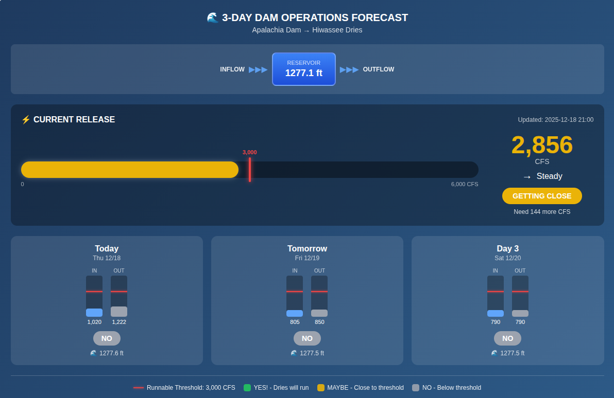
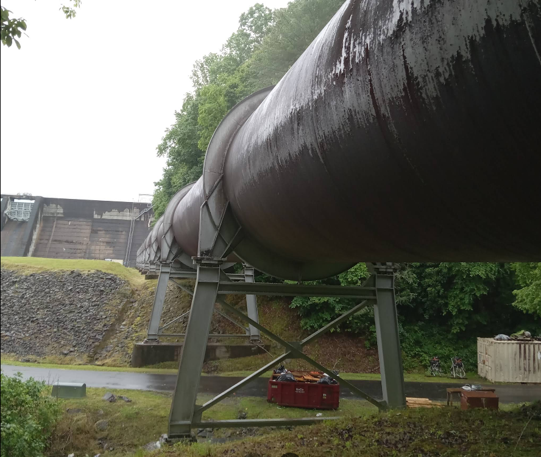
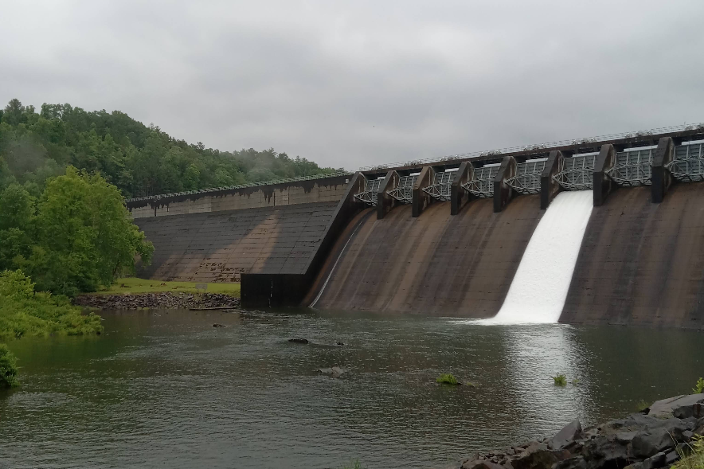

# TVA Hiwassee Dries Integration

**Created:** 2025-12-18
**Updated:** 2025-12-19 (Added historical chart with indefinite data storage)
**Status:** COMPLETE - Live in Production
**Production URL:** https://docker-blue-sound-1751.fly.dev/
**Detail Page:** https://docker-blue-sound-1751.fly.dev/details/HADT1.html

## Dam Operations Forecast Panel (12-18-2025)



*The detail page for Hiwassee Dries features a 3-day Dam Operations Forecast panel showing current release status, inflow/outflow predictions, and runnable conditions.*

### Panel Features

- **Water Flow Diagram**: Visual representation of Inflow → Reservoir → Outflow
- **Current Release Gauge**: Real-time CFS with visual gauge showing position relative to thresholds
- **Dual Threshold Markers**:
  - 💧 Blue marker at 500 CFS - "Spillway Opens" (water starts flowing into Dries)
  - 🚣 Red marker at 3,000 CFS - "Runnable" (good paddling conditions)
- **Trend Indicator**: Shows if release is Rising (↗), Steady (→), or Falling (↘)
- **3-Day Forecast Cards**: Predicted inflow/outflow for Today, Tomorrow, and Day 3
- **Runnable Status**: Color-coded badges (Green=YES!, Yellow=MAYBE, Gray=NO)
- **Today's Story Table**: Hourly observations showing dam operations with plain-English explanations
- **Historical Chart**: Long-term trends with indefinite data storage (see below)

### Historical Dam Operations Chart (NEW - 2025-12-19)

The detail page now includes a **Historical Dam Operations** chart at the bottom, providing long-term trend visualization:

- **Time Range Selector**: Buttons for 7 Days, 30 Days, 90 Days, and 1 Year views
- **Dual-Axis Chart**:
  - Left axis (red): Release (CFS)
  - Right axis (blue/green): Lake Level and Tailwater (ft)
- **Stats Cards**: Observation count, max release, avg release, data range
- **Indefinite Storage**: Data is stored permanently in SQLite database

**API Endpoints:**
```bash
# Get 7 days of historical data
curl "https://docker-blue-sound-1751.fly.dev/api/tva-history/HADT1?days=7"

# Get statistics for 30 days
curl "https://docker-blue-sound-1751.fly.dev/api/tva-history/HADT1/stats?days=30"
```

**Response Format:**
```json
{
  "site_code": "HADT1",
  "days_requested": 7,
  "observation_count": 168,
  "date_range": {
    "earliest": "2025-12-12T00:00:00",
    "latest": "2025-12-19T14:00:00"
  },
  "stats": {
    "discharge_cfs": {"min": 30, "max": 2853, "avg": 924.1},
    "pool_elevation_ft": {"min": 1276.5, "max": 1278.5, "avg": 1277.4},
    "tailwater_ft": {"min": 837.3, "max": 840.5, "avg": 838.9}
  },
  "observations": [
    {"timestamp": "2025-12-19T07:00:00", "discharge_cfs": 1476, "pool_elevation_ft": 1277.51, "tailwater_ft": 839.5},
    ...
  ]
}
```

## Overview

The **Hiwassee Dries** is a 13-mile section of the Hiwassee River between Apalachia Dam and Apalachia Powerhouse in Tennessee/North Carolina. This section is normally dewatered because TVA diverts water through an 8.3-mile underground tunnel to the powerhouse.



*The flume and tunnel intake structure at Apalachia Dam - this is where water enters the 8.3-mile tunnel to the powerhouse, bypassing the Dries section of the river.*

**The Dries only run when:**
- Apalachia Dam spillway gates are opened
- High inflows exceed what the tunnel can handle
- Maintenance requires bypass flow

When running, the Dries offer Class III/IV whitewater - a rare and exciting opportunity!

## TVA API Discovery

### Working Endpoint

```
https://www.tva.com/RestApi/observed-data/HADT1.json
```

**No authentication required!** Returns JSON array of hourly observations.

### Response Format

```json
[
    {
        "Day": "12/18/2025",
        "Time": "8 AM EST",
        "ReservoirElevation": "1,277.81",
        "TailwaterElevation": "840.48",
        "AverageHourlyDischarge": "2,848"
    }
]
```

### Field Descriptions

| Field | Description | Units | Notes |
|-------|-------------|-------|-------|
| `Day` | Date of observation | MM/DD/YYYY | Eastern time |
| `Time` | Hour of observation | "H AM/PM EST" | End of hour |
| `ReservoirElevation` | Pool level above dam | feet MSL | Normal range: 1,272-1,280 ft |
| `TailwaterElevation` | Water level below dam | feet MSL | Rises with discharge |
| `AverageHourlyDischarge` | Water released from dam | CFS | **KEY METRIC** |

### Interpreting Discharge for Paddlers

| Discharge (CFS) | Status | Meaning |
|-----------------|--------|---------|
| 0-100 | Dry | Normal leakage only, Dries are dry |
| 100-500 | Minimal | Some flow, not paddleable |
| 500-1,500 | Low Runnable | Dries starting to run, technical paddling |
| 1,500-3,000 | Good Flow | Solid Class III-IV conditions |
| 3,000+ | High Water | Big water, expert only |

**Note:** These thresholds are estimates. Real-world calibration from paddlers who've run the Dries would improve accuracy.

### Understanding Discharge vs Tailwater Elevation

Based on observed data from 12/18/2025, here's the relationship between discharge (CFS) and tailwater elevation:

| Discharge (CFS) | Tailwater Elevation | What's Happening |
|-----------------|---------------------|------------------|
| 30-45 CFS | ~837.3-837.6 ft | Dam quiet, Dries dry |
| ~500 CFS | ~838-838.5 ft (estimated) | Spillway opening, water starts flowing |
| ~1,500 CFS | ~839.5 ft | Dries filling up |
| ~2,850 CFS | ~840.5 ft | Near runnable conditions |

The tailwater rises about **2-3 feet** from "dry" (~837 ft) to "full release" (~840.5 ft) as more water pours through the spillway gates.

**Important Distinction:** The tailwater elevation is measured right at the base of the dam - it shows how high the water is pooling immediately below the spillway. The "Dries" section extends **13 miles downstream** from there to the powerhouse, so the tailwater reading doesn't directly tell you the water level throughout the Dries - it's more of an indicator of how much water is being released.

**Key Thresholds on the Dashboard Gauge:**
- 💧 **500 CFS** (~838 ft tailwater) - "Spillway Opens" - Water starts flowing into Dries
- 🚣 **3,000 CFS** (~840.5 ft tailwater) - "Runnable" - Good paddling conditions

## Technical Details

### API Characteristics

- **Update Frequency:** Hourly (data reported at end of each hour)
- **Data Range:** Returns ~8-24 hours of recent observations
- **Rate Limiting:** Unknown, recommend caching (5-15 min intervals)
- **Cloudflare:** The main tva.com site has bot protection, but this REST API endpoint works with simple HTTP requests
- **User-Agent:** Standard browser UA recommended

### Example API Call

```bash
curl -s "https://www.tva.com/RestApi/observed-data/HADT1.json" \
  -H "User-Agent: Mozilla/5.0" | python3 -m json.tool
```

### Related TVA Endpoints

| Endpoint | Description | Status |
|----------|-------------|--------|
| `/RestApi/observed-data/HADT1.json` | Hiwassee Dries observations | **WORKING** |
| `/RestApi/predicted-data/HADT1.json` | Hiwassee 3-day forecast | **WORKING** |
| `/RestApi/observed-data/OCCT1.json` | Ocoee #3 (Upper) observations | **WORKING** |
| `/RestApi/observed-data/OCBT1.json` | Ocoee #2 (Middle) observations | **WORKING** |
| `/RestApi/observed-data/OCAT1.json` | Ocoee #1 (Lower) observations | **WORKING** |
| `/RestApi/predicted-data/DUGT1.json` | Douglas Dam predictions | Working |

**Note:** Ocoee rivers were added on 2025-12-21. See [OCOEE_RESEARCH.md](OCOEE_RESEARCH.md) for details.

### Predicted Data API (3-Day Forecast)

```
https://www.tva.com/RestApi/predicted-data/HADT1.json
```

Returns 3-day operational forecast for dam releases:

```json
[
    {
        "Day": "12/18/2025",
        "AverageInflow": "1,020",
        "MidnightElevation": 1277.58,
        "AverageOutflow": "1,222"
    },
    {
        "Day": "12/19/2025",
        "AverageInflow": "805",
        "MidnightElevation": 1277.5,
        "AverageOutflow": "850"
    },
    {
        "Day": "12/20/2025",
        "AverageInflow": "790",
        "MidnightElevation": 1277.5,
        "AverageOutflow": "790"
    }
]
```

| Field | Description | Use for Paddlers |
|-------|-------------|------------------|
| `AverageInflow` | Water entering reservoir (CFS) | High inflow = potential releases |
| `MidnightElevation` | Expected pool level at midnight (ft MSL) | Pool management |
| `AverageOutflow` | **Expected discharge (CFS)** | **Will Dries run tomorrow?** |

**Key Insight:** If `AverageOutflow` >= 3,000 CFS, the Dries should be runnable that day!

### Site Code Pattern

TVA uses NWS-style location identifiers:
- `HADT1` = **H**iwassee **A**bove **D**am **T**ennessee **1**
- `DUGT1` = **DU**glas **G**? **T**ennessee **1**

## Apalachia Dam Facts



*Apalachia Dam and reservoir pool - water is diverted through an 8.3-mile tunnel to the powerhouse, leaving the "Dries" section normally dewatered.*

- **Location:** Cherokee County, NC (dam) / Polk County, TN (powerhouse)
- **Built:** 1941-1943
- **Height:** 150 feet
- **Length:** 1,308 feet
- **Spillway:** 10 radial gates, max 136,000 CFS capacity
- **Normal Pool:** 1,272-1,280 ft elevation (fluctuates ~8 ft daily)
- **Tunnel:** 8.3 miles to powerhouse, carries generation flow
- **Powerhouse Capacity:** 82 MW (2 generating units)

## NOAA/NWS Alternative

NOAA also provides data for this location:

```
https://api.water.noaa.gov/nwps/v1/gauges/hadt1/stageflow
```

Returns pool elevation but **no discharge data** (secondary = -999).

The TVA API is the better source for discharge/spillway information.

## Implementation Status: COMPLETE

All integration completed on 2025-12-18:

### Files Created/Modified

| File | Action | Description |
|------|--------|-------------|
| `tva_fetch.py` | Created | TVA REST API client with trend data + 3-day forecast panel + historical chart |
| `tva_history.py` | Created | SQLite database module for indefinite historical storage |
| `site_detail.py` | Modified | Integrated TVA forecast panel into detail pages |
| `api_app.py` | Modified | Added `/api/tva-history` endpoints for historical data |
| `gauges.conf.json` | Modified | Added Hiwassee Dries site config |
| `gauges.conf.cloud.json` | Modified | Added Hiwassee Dries site config |
| `pws_observations.py` | Modified | Added PWS stations and labels |
| `usgs_multi_alert.py` | Modified | Added TVA source handling + 12hr trend sparklines + history storage |
| `Containerfile.api.simple` | Modified | Added COPY for tva_fetch.py and tva_history.py |
| `GPS.txt` | Modified | Added Hiwassee Dries PWS stations |

### TVA Data Functions

The `tva_fetch.py` module provides comprehensive TVA data access:

#### Trend Data (for sparklines)

```python
from tva_fetch import get_tva_trend_data, get_tva_trend

# Get 12-hour trend data for sparklines
trend_data = get_tva_trend_data('HADT1', hours=12)
# Returns: {"values": [1479.0, 62.0, ...], "direction": "rising"}

# Get text trend label
trend = get_tva_trend('HADT1', hours=4)  # Returns: "rising", "falling", or "steady"
```

#### Forecast Data (3-day predictions)

```python
from tva_fetch import get_tva_forecast, generate_tva_forecast_html

# Get parsed forecast with runnable status
forecast = get_tva_forecast('HADT1', runnable_threshold=3000)
# Returns list of dicts:
# [
#     {
#         "day": "12/18/2025",
#         "day_label": "Today",
#         "inflow_cfs": 1020,
#         "outflow_cfs": 1222,
#         "pool_elevation_ft": 1277.58,
#         "runnable_status": "no",
#         "runnable_label": "NO",
#         "runnable_color": "#9ca3af"
#     },
#     ...
# ]

# Generate complete HTML forecast panel for detail page
html = generate_tva_forecast_html('HADT1', runnable_threshold=3000)
```

#### Historical Data (indefinite storage)

```python
from tva_history import init_database, save_observations_batch, get_observations, get_stats

# Initialize database (call once at startup)
init_database("/data/tva_history.sqlite")

# Save observations (automatically deduplicated by timestamp)
observations = [
    {'timestamp': '2025-12-19T14:00:00', 'discharge_cfs': 1476, 'pool_elevation_ft': 1277.5, 'tailwater_ft': 839.5},
    {'timestamp': '2025-12-19T15:00:00', 'discharge_cfs': 1500, 'pool_elevation_ft': 1277.4, 'tailwater_ft': 839.6}
]
saved_count = save_observations_batch('HADT1', observations)  # Returns number of NEW observations saved

# Get historical data
data = get_observations('HADT1', days=7)  # Last 7 days
# Returns: [{'timestamp': '...', 'discharge_cfs': 1476, 'pool_elevation_ft': 1277.5, 'tailwater_ft': 839.5}, ...]

# Get statistics
stats = get_stats('HADT1', days=30)
# Returns: {'discharge_cfs': {'min': 30, 'max': 2853, 'avg': 924.1}, ...}
```

**Sparkline Features:**
- Red line when below threshold (3,000 CFS)
- Green line when at/above threshold
- Dashed horizontal threshold line
- Dot at current value
- Shows dam release patterns (spillway gates opening/closing)

### Site Configuration

```json
{
  "source": "tva",
  "tva_site_code": "HADT1",
  "name": "Hiwassee Dries",
  "include_discharge": true,
  "min_ft": null,
  "min_cfs": 3000,
  "good_ft": null,
  "good_cfs": 5000,
  "lat": 35.168,
  "lon": -84.298
}
```

### Weather Stations

| Station ID | Location | Distance from Dam |
|------------|----------|-------------------|
| KNCMURPH4 | Murphy, NC (Tarheel) | ~15 miles |
| KTNBENTO3 | Benton, TN | ~20 miles |
| KTNCLEVE20 | Cleveland, TN (Prospect) | ~30 miles |

### Live Data Verification (2025-12-18 at 10:08 AM EST)

```
[INFO] [TVA] Hiwassee Dries: 1278.04 ft - 2853 cfs @ 2025-12-18T09:00:00 (mins: 3000 cfs) -> OUT
[PWS] Hiwassee Dries: 54.1°F, 3.5 mph from KNCMURPH4 (MURPHY)
[FEED] wrote /site/gauges.json (8 sites, 7 predictions)
```

**Current Status:**
- Discharge: 2,853 CFS (below 3,000 threshold = OUT, but RISING)
- Pool Level: 1,278.04 ft MSL
- Weather: 54.1°F, 3.5 mph wind from Murphy NC PWS

**Threshold:** 3,000 CFS for "runnable" (green) status

---

## Implementation Plan (Reference)

### Phase 1: Create TVA Fetch Module

Create `tva_fetch.py` similar to existing modules:

```python
"""
TVA Dam Data Fetcher
Fetches observed data from TVA REST API for dam monitoring.
"""

import requests
import json
from datetime import datetime

TVA_API_BASE = "https://www.tva.com/RestApi/observed-data"

def fetch_tva_observed(site_code: str, timeout: int = 30) -> list:
    """
    Fetch observed data from TVA API.

    Args:
        site_code: TVA site code (e.g., 'HADT1' for Apalachia)
        timeout: Request timeout in seconds

    Returns:
        List of observation dicts with keys:
        - Day, Time, ReservoirElevation, TailwaterElevation, AverageHourlyDischarge
    """
    url = f"{TVA_API_BASE}/{site_code}.json"
    headers = {"User-Agent": "Mozilla/5.0 (compatible; USGS-River-Monitor/1.0)"}

    response = requests.get(url, headers=headers, timeout=timeout)
    response.raise_for_status()

    return response.json()

def get_latest_discharge(site_code: str) -> dict:
    """
    Get the most recent discharge reading.

    Returns dict with:
        - discharge_cfs: int
        - pool_elevation_ft: float
        - tailwater_ft: float
        - timestamp: datetime
        - is_spilling: bool (discharge > threshold)
    """
    data = fetch_tva_observed(site_code)
    if not data:
        return None

    latest = data[-1]  # Most recent observation

    # Parse the numeric values (they have commas)
    discharge = int(latest['AverageHourlyDischarge'].replace(',', ''))
    pool = float(latest['ReservoirElevation'].replace(',', ''))
    tailwater = float(latest['TailwaterElevation'].replace(',', ''))

    # Parse timestamp
    time_str = f"{latest['Day']} {latest['Time']}"
    # Handle "8 AM EST" format
    timestamp = datetime.strptime(time_str.replace(' EST', '').replace(' EDT', ''),
                                   '%m/%d/%Y %I %p')

    return {
        'discharge_cfs': discharge,
        'pool_elevation_ft': pool,
        'tailwater_ft': tailwater,
        'timestamp': timestamp,
        'is_spilling': discharge >= 500  # Threshold for "running"
    }
```

### Phase 2: Add to Configuration

Add to `gauges.conf.json`:

```json
{
    "site": "TVA-HADT1",
    "name": "Hiwassee Dries",
    "type": "tva",
    "tva_site_code": "HADT1",
    "include_discharge": true,
    "min_cfs": 500,
    "good_cfs": 1500,
    "lat": 35.168,
    "lon": -84.298
}
```

### Phase 3: Dashboard Integration

- Display current discharge prominently
- Color coding: Gray (dry) / Yellow (low) / Green (good) / Red (high)
- Show trend (rising/falling/steady)
- Include pool elevation as secondary info

### Phase 4: Alerts (Optional)

- Email alert when discharge exceeds threshold
- "Hiwassee Dries is RUNNING!" notification
- Include estimated duration based on forecast

## Reference Links

- **TVA Apalachia Page:** https://www.tva.com/environment/lake-levels/apalachia
- **NOAA Gauge:** https://water.noaa.gov/gauges/hadt1
- **American Whitewater:** https://www.americanwhitewater.org/content/Project/view/id/Hiwassee+Dries/
- **Recreation Releases:** https://www.tva.com/environment/lake-levels/Apalachia/Recreation-Release-Calendar

## Notes

- The "Dries" section is UPSTREAM of the powerhouse (between dam and powerhouse)
- The popular Hiwassee run below the powerhouse is a different section
- TVA occasionally schedules recreational releases - check their calendar
- High rainfall events can cause unscheduled spillway releases

---

*Document created during API discovery session with Claude Code*
